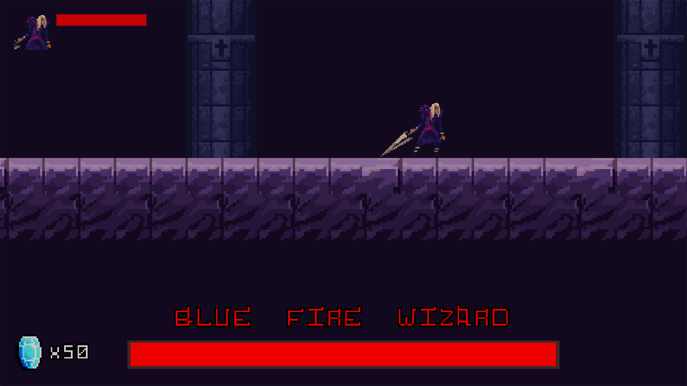

> # GAME DESIGN DOCUMENT
> 
> Creado por: Alberto Soutullo Otero
>
> Versión del documento: 1.00
>
> ## HISTORIAL DE REVISIONES
>
>
>| Versión      | Fecha        | Comentarios  |
>|--------------|--------------|--------------|
>| 1.0          | 12/05/2024   |  Documento   |
>|              |              |              |
> 
> ## RESUMEN
> 
>Dante, sin saber que le había pasado, se encontró con una maldición que lo hacía ser inmortal contra todo lo que no fuese un no muerto, Con espada en mano y sin nada que perder decidió enbarcarse en una aventura para derrotar al mago que le había hecho esto o por fín poder descansar en paz.
> 
> ## Concepto
>
> Dante's Memories es un juego estilo metroidvania que se centra tanto en la recolección de items como en el combate y las plataformas.
>
> ## Puntos Clave
>
> * Recorrido alrededor de un mapa lleno de peligros y muertos vivientes.
> * Recolección de monedas y vidas.
> * Pelea cuerpo a cuerpo con enemigos.
> * Batalla contra un jefe en una mezcla con mecánica de salto propia.
>   
> ## Género
>
> * MetroidVania.
>
> ## Público Objetivo
>
> El público en el que se centra Dante's Memories es un público más bien adulto.
>
> ## Experiencia de Juego
>
> La experiencia es bastante frenética dado a las sencillas pero a la vez complicadas mecánicas de movimiento y combate a lo largo del escenario.
>
> ## DISEÑO
>
> ### Meta
>
> * Diseñar mecánicas que promuevan los reflejos del jugador y que requieran su constante atención debido al gameplay frenético.
>   
> ## MECÁNICAS DE JUEGO
>
> ### Controles
>
> WASD - Moverse.
>
> Espacio - Saltar.
>
> Click izqrdo. - Pegar.
>
> Esc - Menu.
>
> Ctrl. izqrdo. - Agacharse.
>
> ### Cámara
>
> La cámara se basa en una escena 2D con vista isométrica donde ocurre todo mediante arte pixelart pero con todo tipo de detalles.
>
> ### Fin de Juego
>
> * Derrota: Perder las vida (la barra baje completamente).
> * Victoria: Derrotar al mago.
>
> ## WORLDBUILDING
>
> ### Descripción General
>
> El juego se basa en un mundo donde las maldiciones, así como los cuentos y criaturas de época son cosa de la orden del día.
>
> ### Personajes
>
> * Jugables:
>
>   * Dante: Personaje principal, y el controlado por el jugador a lo largo del mapa
>   
>       
>
> 
> * Enemigos:
>
>   * Esqueletos: Enemigos sin alma controlados por el mago los cuales se encatgarán de hacernos daño tanto chocando contra nosotros como mediante proyectiles
>   
>       
>
> * Jefes:
>
>   * Mago del fuego azul: El creador de todo este cementerio de pura maldad que se tratará como mapa en esta entrega, pudiendo teletransportarse y lanzar llamas a La posición actual de dante
>   
>       
> 
> ### Objetos
>
> * Corazón: Da vida al personaje.
>
> 
>
> * Diamante: Da moneda al personaje.
>
> 
>
> * Cofre: Lo mismo que el diamante pero en mayor cantidad.
>
> 
> 
> ## INTERFAZ
> 
> ### Pantalla de Inicio:
>
> * Información: Suelta el título del videojuego mediante tipografía personalizada (como el resto de menus del juego) sobre pulsar cualquier tecla para comenzar.
>
> 
>
> ### Pantalla Principal:
>
> * Información: Aquí comienza el gameplay, a lo largo de la escena nos encargaremos de los muertos vivientes controlados por el mago hasta llegar a su castillo, con el cual deberemos acabar para dar un poco más de paz al corroido mundo.
>
> 
>
> ### Pantalla de Pausa:
>
> * Información: Un menú simple el cual nos informa de nuestras opciones posibles en el propio texto indicado en pantalla.
>
> 
>
> ### Pantalla Gameover:
>
> * Información: Pantalla que aparecerá cuándo nuestro personaje fallezca y que también compartirá información sobre sus opciones.
>
> 
>
> ### Pantalla de Victoria:
>
> * Información: Pantalla que se mostrará segundo y medio después de acabar con el mago, dando tiempo a que su animación de muerte termine y proceda a indicar al jugador sus opciones después de pasar la pantalla.
>
> 
>
>  ### HUD
>
> * Icono de personaje.
>
> * Barra de vida.
>
> * Dinero acummulado
>
>   * Momentaneo durante el Jefe:
>
>       * Nombre del Jefe
>
>       * Barra de vida del jefe
>
> 
> 
> ### ARTE
>
> ### Meta
>
> Inspirar terror mediante la atmosfera del videojuego pero chocando con un arte que pudiera ser etiquetado como "infantil" así como puede ser un pixelart.
> 
> ### Assets
> 
> * Animaciones de personaje.
>
> * Animaciones de enemigos.
>
> * Sprites de coleccionables.
>
> * Arte del mapa (tilemaps) (tanto físico como únicamente decorativo).
>
> ## AUDIO
>
> ### Meta
>
> Sentir cada movimiento e interacción no solo por la vista, si no también por el oído, sin poder faltar una buena banda sonora que lo acompañe.
>
> ### Assets
>
> * Efectos de sonido de las monedas, los corazones, el golpeo de enemigos, el ataque, los proyectiles, el menú de pausa, el de gameover, ...
>   
> * Música, tanto la banda sonora de la gran mayoría de la pantalla como la específica para la batalla contra el boss.
>
> ## DETALLES TÉCNICOS
>
> ### Plataforma
>
> El juego se desarrollará para PC pero teniendo en mente desplazarse a cualquier otra plataforma.
> 
> ### Herramientas de Desarrollo
>
> * Motor del juego: Unity.
> * Arte: Asset Store.
> * Música y sonido: Asset Store.
